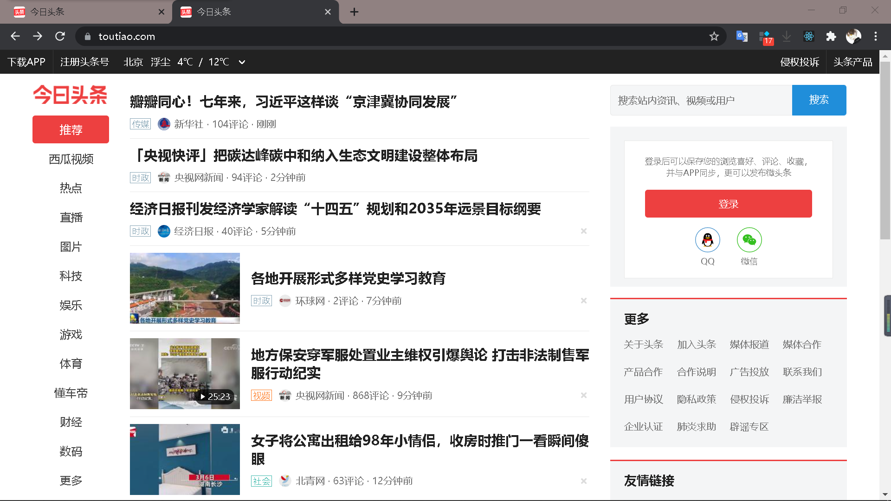
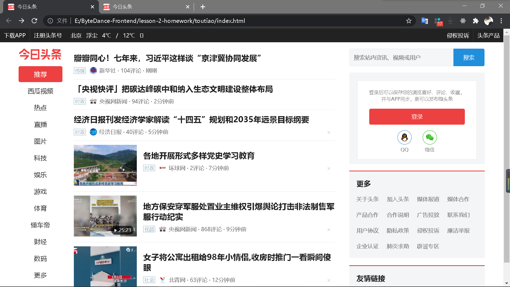
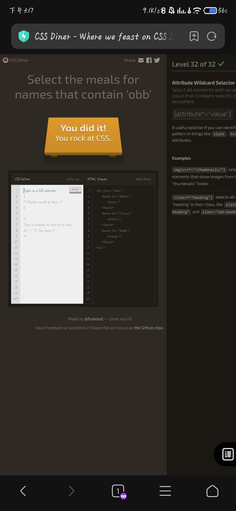

# Lesson 2 Homework

## Details

1. 制作今日头条首页第一屏

    第一屏采样截屏：
    

    成果截屏展示：
    

    除直观界面外，还实现了**tag#\<a\>🔗等**的*hover特效*，如左侧导航栏、右侧按键、居中标题图片、'不感兴趣'的叉号❌图标等

    （注：一些图片不在本地目录中，在无网络下可能影响预览体验）

2. 模拟实现典型网页布局

    这里选择**绝对定位**的网页布局进行模拟实现

    1. [列绝对定位](./layout/col_abs.html)
    2. [列绝对定位标题脚注](./layout/col_abs_head_foot.html)

3. 通关CSS选择器小游戏，截图如下

    

4. 动画制作

   基于transform和高斯模糊实现的[animation](./animation/animation.html)，[参考](https://codemyui.com/matrix-inspired-text-scroll-animation/)
