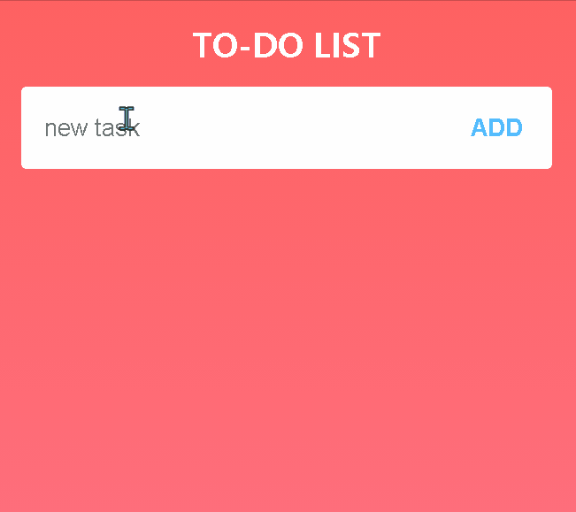

# Lesson 3 Homework

\(@^0^@)/

## Details

1. why .1 + .2 != .3?

    [explanation here](./why0.1+0.2!==0.3.md)

2. DOM ops

    这一部分说起来并没有严格按照老师的要求，即对样式及操作逻辑均有结合自己理解的改动

    - 样式上：革除示例中组件拥挤之风，整体更加清洁自然
    - 操作逻辑上：个人认为复选框勾选与否应该作为clear的依据，而不是点击`clear`后一股脑地全部清除

    本部分未改动html代码，仅有js脚本操控

    查看演示

    

3. Toutiao Request

    ```txt
    在之前模仿的基础上，增加主动获取网络请求部分

    1. 抓取页面中的数据，保存起来
    2. 本地启动一个小server来发送数据
    3. 支持页面滑到底部后，自动请求数据并追加展示
    4. 时间数据可以做到相对实现，以小时、分钟、天为维度
    5. 对于大数据可以做到聚合，万以上的数量进行聚合
    ```

    - 1-2部分详情见[/Spider](./Spider/README.md)
    - 3-4部分详情见[/Toutiao](./Toutiao/README.md)
    - 5理解除了小差错，不是大数据，而是`大的数据`，只需要简单对评论数进行聚合即可

    **Notes: 特别注意，由于某种原因，本人ip被封，故将server在服务器上部署了一份，仅在本周六（3.27）上课前开放。**

    检阅时若在本地启动server（若使用服务器ip请善待它~），可在[content.js #line2](./Toutiao/content.js)将ip改为`localhost`，并在`/Spider`目录下运行

    > node server.js

    本项目node version: v14.16.0
