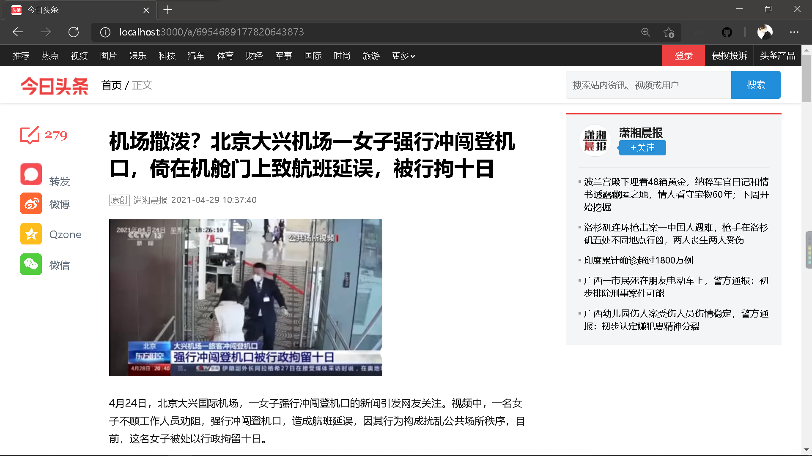

# ByteDance FE Project README

> 👨‍💻

## 项目需求

1. 复刻已有产品
2. 可以在断网的情况下可以正常运行、演示
3. 基本功能要求：
    - 首页 ✅
    - 二级页面 ✅
    - 首页可以导航到二级页面 ✅
    - 支持SSR ✅
4. 高级功能如下
    - 性能优化到足够好（LightHouse的结果）✅
    - 离线化的支持
    - PWA支持
5. 项目中的关键点
    - Next.js(React Framework) ✅
    - SSR的基本概念和用法 ✅
    - 代码管理和组织 ✅
    - 组件的划分和管理 ✅
    - 异步操作的处理和状态管理
    - 项目的构建、打包优化、发布 ✅
    - 测试 ✅

## 说明

1. 本项目复刻已有产品，成品展示如下

    首页

    

    二级页面

    二级页面文章内容的数据是写死的，其中文章内容的数据为jsx格式，我们处理成字符串，并使用**react-html-parser**模块进行解析

    

    由首页跳转到二级页面，采用**next/link**`动态路由`

    ```jsx
    <Link href={{
        pathname: '/a/[id]',
        query: {
            title: xx,
            id: xx
        }
    }} as={`/a/${id}`}><a>xxx</a></Link>
    ```

    这里我们通过`query`传递参数，由于前面说到二级页面的文章内容是写死的，**为体现页面跳转到不同的页面的效果，传递参数title作为二级页面的标题**，该title与首页中用户点击的新闻标题相关

2. 本项目原本设计了爬取*今日头条*网站数据并转发给前端的[后台系统](../lesson-3-homework/Spider/server.js)，但是考虑到**断网的情况下可以正常运行、演示**的要求，最终决定采用写死的数据，但这与本项目中实现的**动态数据显示**并不冲突

3. 本项目采用Next.js框架开发，**自带支持SSR**，使用`getServerSideProps`方法实现数据的拉取，进而实现服务端渲染。需要注意的是，该方法必须写在page下，在component下将不会调用

4. LightHouse性能优化

    生成的优化结果文件参见[lighthouse](./lighthouse/)目录

    效果如下：

    首页

    

    二级页面

    

5. 代码通过[Github Repo](https://github.com/Laffery/ByteDance-Frontend/tree/master/project)持续集成

6. 测试仅采用黑盒测试方法，通过浏览器点击对页面可用性进行测试
